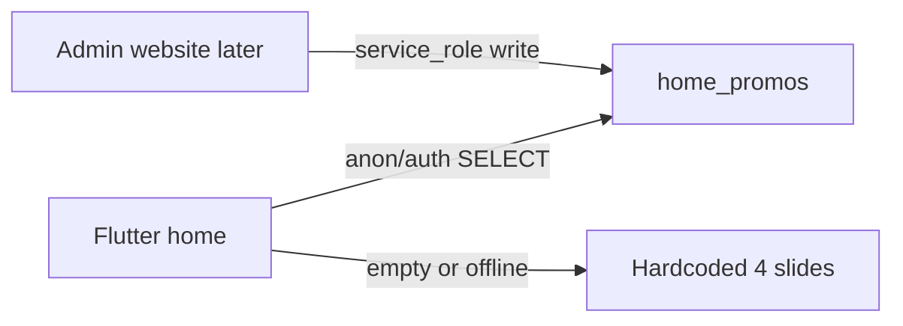

# Admin-manageable home promo cards

## Current state

[`promo_carousel.dart`](../lib/features/home/presentation/widgets/promo_carousel.dart) hardcodes 4 gradient cards (navy / teal / purple / red) with localized strings from [`app_strings.dart`](../lib/shared/models/app_strings.dart). No images, no DB.

## Approach



- **Exactly 4 fixed slots** (`slot` 1–4), matching today’s carousel.
- Admin site (not built here) will CRUD via **Supabase service role** (bypasses RLS). App only reads.
- Each card: `image_url`, `headline`, `subtitle`, `theme` (`navy` | `teal` | `purple` | `red` — same gradients as today).

## 1. Database migration

Add [`supabase/migrations/015_home_promos.sql`](../supabase/migrations/015_home_promos.sql):

```sql
create table public.home_promos (
  slot int primary key check (slot between 1 and 4),
  headline text not null,
  subtitle text not null default '',
  image_url text,                    -- optional; null = icon-only like today
  theme text not null default 'navy'
    check (theme in ('navy', 'teal', 'purple', 'red')),
  is_active boolean not null default true,
  updated_at timestamptz not null default now()
);
```

- Seed rows 1–4 with current English copy + matching themes.
- RLS: `SELECT` for `anon` + `authenticated` where `is_active = true`.
- No INSERT/UPDATE/DELETE policies for client roles — admin site uses service role.

Optional storage note for admin site (comment in migration): upload images to Cloudinary or a public Supabase `promos` bucket, store the public URL in `image_url`.

## 2. Flutter model + fetch

- Add [`lib/shared/models/home_promo.dart`](../lib/shared/models/home_promo.dart): `slot`, `headline`, `subtitle`, `imageUrl`, `theme`, plus theme → `Color` accent/accentLight mapping (existing 4 palettes).
- Add `fetchHomePromos()` on the repository (same pattern as listings): select active rows ordered by `slot`.
- Hold `List<HomePromo> homePromos` on app state; load in `loadAllData()` (guest + signed-in) so the carousel works for everyone.

## 3. Update `PromoCarousel`

Refactor [`promo_carousel.dart`](../lib/features/home/presentation/widgets/promo_carousel.dart):

- Prefer `state.homePromos` when non-empty; else keep today’s hardcoded slides as fallback.
- Card layout: keep gradient from selected `theme`; if `imageUrl` is set, show it on the right (or as a soft background) instead of/alongside the icon circle; headline + subtitle from DB.
- Auto-scroll uses the loaded list length (still typically 4).

## 4. Admin contract (for the future website)

Document in [`assets/promo/README.md`](../assets/promo/README.md):

| Field | Type | Notes |
|-------|------|--------|
| `slot` | 1–4 | Fixed card position |
| `headline` / `subtitle` | text | Shown as-is on the card |
| `image_url` | text nullable | Public HTTPS URL |
| `theme` | enum | `navy`, `teal`, `purple`, `red` |
| `is_active` | bool | Inactive slots fall back to hardcoded for that slot or are skipped |

Writes: service role only. No Flutter admin UI.

## Implementation todos

1. Add `home_promos` migration: table, seed 4 slots, public SELECT RLS
2. Add `HomePromo` model, theme palette map, `fetchHomePromos` + app state load
3. Refactor `PromoCarousel` to use DB promos with image + theme; keep hardcoded fallback
4. Update `assets/promo/README.md` with admin field contract

## Out of scope

- Admin web app UI
- Multilingual DB columns (admin can write Amharic/Somali text into headline/subtitle if desired; app displays stored strings as-is)
- Changing carousel UX beyond image + remote text/theme
