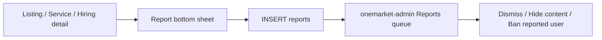

# Reports & flagging for listings, services, and job posts

## Current state

Partial plumbing already exists; the missing piece is the user-facing flow and multi-content targeting.

| Layer | Today |
|-------|--------|
| DB | [`reports`](../supabase/migrations/001_schema.sql) has `listing_id` + `reported_user_id` only — no service or hiring post |
| App | [`submitReport`](../lib/shared/services/parts/supabase_repository_hiring.dart) + [`app_state`](../lib/shared/services/parts/app_state_chat.dart) exist; **no UI calls them** |
| Admin | [`ReportsPage`](../../onemarket-admin/src/pages/ReportsPage.tsx) lists reports, dismisses, or bans the **reporter** (not the reported content) |

**v1 scope:** user-initiated reports only. “Detecting action” = the report sheet is opened from a specific detail screen and automatically attaches the correct target (`listing` / `service` / `hiring_post`) plus owner as `reported_user_id`. No automatic spam/keyword scanners in v1.

---

## 1. Database: widen `reports`

Add migration `020_reports_content_targets.sql` in onemarket:

- Add nullable FKs: `service_id → services(id)`, `hiring_post_id → hiring_posts(id)` (ON DELETE SET NULL)
- Add `status text not null default 'pending'` with check (`pending` | `dismissed` | `actioned`)
- Add `target_type text` check (`listing` | `service` | `hiring_post` | `user`) for easy admin filtering
- Constraint: at least one of `listing_id`, `service_id`, `hiring_post_id`, `reported_user_id` is set
- Optional uniqueness: one open report per `(reporter_id, target)` to reduce spam duplicates
- Keep existing RLS (users insert/select own rows); admin continues via service role

Standard reasons (store as plain `reason` text, same as today):

- Spam / scam
- Misleading or false information
- Inappropriate content
- Harassment or unsafe
- Other (requires `details`)

---

## 2. Flutter app: shared report flow

**Extend API**

- Update `submitReport` to accept `serviceId`, `hiringPostId`, `targetType`
- Same for `1marketAppState.submitReport`

**Shared UI** — new widget e.g. `lib/shared/widgets/report_bottom_sheet.dart`:

- Requires auth (guest → push auth)
- Reason chips + optional details field
- On submit: call `state.submitReport(...)` with IDs inferred from the opener
- Success snackbar; block self-report (owner viewing own post)

**Wire into detail screens** (overflow / flag icon on AppBar — only when content is not owned by current user):

- [`listing_detail_screen.dart`](../lib/features/listings/presentation/screens/listing_detail_screen.dart) → `listingId` + seller id
- [`service_detail_screen.dart`](../lib/features/services/presentation/screens/service_detail_screen.dart) → `serviceId` + owner id
- [`hiring_detail_screen.dart`](../lib/features/hiring/presentation/screens/hiring_detail_screen.dart) → `hiringPostId` + poster id

**Strings** in [`app_strings.dart`](../lib/shared/models/app_strings.dart) (EN / Amharic / Somali): report title, reasons, success/error, login required.

---

## 3. Admin: review queue for all target types

In **onemarket-admin**:

- Extend [`Report`](../../onemarket-admin/src/types/database.ts) with `service_id`, `hiring_post_id`, `target_type`, `status`
- Update `GET /api/reports` joins to include `service:services(...)`, `hiring_post:hiring_posts(...)`
- [`ReportsPage`](../../onemarket-admin/src/pages/ReportsPage.tsx): show target type + title; filters by reason and target type; deep-link to listing/service/hiring detail when present
- Moderation actions (replace misleading “ban reporter” as primary action):
  - **Dismiss** → set `status = dismissed` (prefer soft status over hard delete)
  - **Hide / remove content** → delete or soft-hide the reported listing/service/hiring post, set `status = actioned`
  - **Ban reported user** → remove reported user’s profile/content (current ban flow retargeted to `reported_user_id`)

---

## 4. Out of scope for this plan

- Automatic content scanning / ML flags
- In-app “my reports” history screen
- Soft-hide columns on listings/services/hiring (can add later; v1 can hard-delete via admin or add `is_hidden` in a follow-up)

---

## Implementation order

1. Migration + deploy
2. Repository / app_state + report bottom sheet + detail-screen entry points
3. Admin types, API joins, ReportsPage actions
4. Smoke-test: report each content type as a non-owner → row appears in admin → dismiss / hide works

## Implementation todos

1. Add migration `020`: `service_id`, `hiring_post_id`, `target_type`, `status` on `reports`
2. Extend `submitReport` + shared `ReportBottomSheet`; wire listing/service/hiring detail screens
3. Add report strings (EN/Am/So) in `app_strings.dart`
4. Update onemarket-admin `Report` type, `GET /api/reports` joins, `ReportsPage` filters/actions
